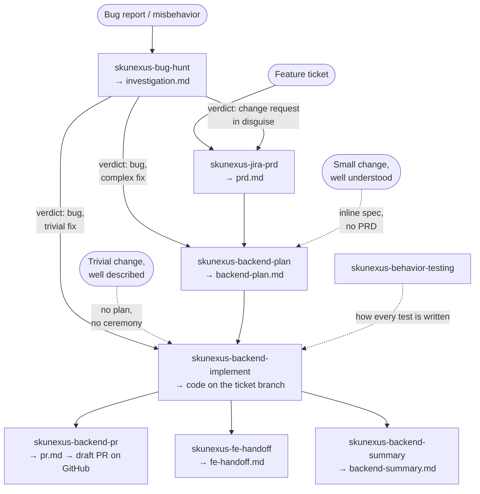

# skunexus-ai

Claude Code skills that implement the **SkuNexus engineering AI workflow**: a pipeline that takes a Jira ticket (or a bug report, or a change described in chat) through requirements, planning, implementation, and the wrap-up documents — with you approving every deliverable before the next step builds on it.

A *skill* is a markdown instruction set (`SKILL.md`) that Claude Code loads automatically when your request matches it. You don't have to invoke skills by name — saying *"let's start PHG-418"* or *"investigate this bug"* triggers the right one. Each section below lists example phrases.

---

## Setup

1. **Install the skills** — symlink (recommended: `git pull` updates propagate) or copy each skill directory into `~/.claude/skills/`:

   ```bash
   git clone <this-repo> && cd skunexus-ai
   ln -s "$PWD"/skills/skunexus-* ~/.claude/skills/
   ```

2. **Prerequisites** the skills rely on:

   | Dependency | Needed by | For |
   |---|---|---|
   | **Atlassian MCP** (Jira) | `skunexus-jira-prd`, `skunexus-bug-hunt` | Fetching and distilling tickets |
   | **Context7 MCP** + the `skunexus-docs-c7` skill | nearly every skill | Building the platform mental model (command bus, plugins, state machines) before touching code. ⚠️ `skunexus-docs-c7` is **not in this repo yet** — get it from a teammate until it's added. |
   | **`gh` CLI**, authenticated | `skunexus-backend-pr` | Pushing the branch and opening the draft PR |
   | **Pest** (client repos) | `skunexus-behavior-testing` | Decides the authoring syntax: Pest where installed, PHPUnit otherwise (core). One-time install: `references/pest-style-guide.md` §0.1 |

3. **Run Claude Code in the repo you're working on** (e.g. `skunexus-client-*`), not in this one. All workflow artifacts land in `.ai/<TICKET>/` inside that working repo.

---

## The workflow at a glance



Two entry points, one build spine, three wrap-up documents. You don't always start at the top — the pipeline **right-sizes its ceremony**: a trivial change can go straight to implementation with no artifacts at all, and downstream skills fall back gracefully (`prd.md` → `investigation.md` → the plan's inline Goal & Acceptance → the real diff).

### Which skill do I start with?

| Situation | Start with |
|---|---|
| Feature ticket, requirements not nailed down | `skunexus-jira-prd` — *"let's start PHG-418"* |
| Something is broken, wrong, or regressed (ticket or not) | `skunexus-bug-hunt` — *"investigate PHG-456"*, *"orders are stuck in status X"* |
| Requirements are agreed, work needs a task breakdown | `skunexus-backend-plan` — *"plan the backend for PHG-418"*, *"skip the PRD, just plan this"* |
| An approved plan exists | `skunexus-backend-implement` — *"implement the plan"*, *"let's do T3"* |
| Trivial, well-described change | `skunexus-backend-implement` — *"just add X to endpoint Y, skip the ceremony"* |
| QA findings / review comments on implemented work | `skunexus-backend-implement` — *"we need to change how X works"* |
| Code is approved, needs a PR | `skunexus-backend-pr` — *"draft the PR"* |
| Frontend team needs the API contract | `skunexus-fe-handoff` — *"prepare the FE handoff"* |
| Ticket's work should be documented for the team | `skunexus-backend-summary` — *"write the backend summary"* |
| Writing, converting, naming or placing a test | `skunexus-behavior-testing` — *"write a test for this command"*, *"where does this test go"* |

---

## What to expect from every skill

These conventions hold across the whole pipeline — internalizing them once is most of the onboarding.

- **You will be interviewed.** The skills never guess: any ambiguous value, boundary, or intent becomes a question to you — usually one focused question at a time, with concrete options to pick from. This is by design; a confident wrong assumption is the most expensive failure mode. Answering "just decide" defeats the point.
- **Every deliverable is a gate.** Documents start as `Status: Draft` and flip to `Approved` **only when you explicitly say so**. Silence is not approval; approving the code is not approving the PR text. Nothing proceeds downstream, and nothing reaches GitHub, without your explicit go-ahead.
- **You review documents in your editor, not in chat.** When a draft is ready, the skill points you at the file (e.g. `.ai/PHG-418/backend-plan.md`) and waits. Read it there, come back with issues or approval — chat walkthroughs of a document you can open are deliberately avoided.
- **Everything resumes from disk.** The `.ai/<TICKET>/` files are the complete state. You can close your laptop, clear context, or open a fresh conversation days later and say *"continue the plan for PHG-418"* — the skill re-reads the folder, recaps where things stand in one line, and picks up.
- **Claude never verifies against your environment.** No migrations, no tinker, no hitting endpoints, no DB queries. Instead it hands you the exact checks to run (*"run `SELECT … WHERE order_id = 4711`"*, the task's *Sanity-check now* list) and treats your results as evidence. The honest handoff is "here's what I built and how you can confirm it". **The one exception is the test suite** — behavior tests run on in-memory SQLite, which isn't your environment, so Claude writes them, runs them, and shows you the real output. That exception is the point: it closes the verify loop. A test Claude can run is the one check it can perform on itself, so a regression gets caught and fixed inside the run instead of parked at your review — which is what makes an orchestrated wave of tasks worth trusting. Everything else on that list is still yours.
- **Ceremony is proportional.** A one-line change gets no PRD, no plan file, no decisions log. Skills escalate visibly when a "trivial" change turns out not to be — and *you* decide whether to escalate or continue.
- **Each skill stops at its boundary.** The PRD skill won't start designing; the plan skill won't start coding; the PR skill won't write testing steps. When a skill finishes, it names the next step and stops — you invoke it when ready.

### The artifact folder: `.ai/<TICKET>/`

Every ticket (or ad-hoc slug for ticketless work) gets one folder in the working repo:

| File | Written by | What it is |
|---|---|---|
| `jira-summary.md` | jira-prd / bug-hunt | Distilled ticket (a subagent reads the noisy Jira payload so your context doesn't) |
| `prd.md` | jira-prd (or a lite version by backend-plan) | The **contract**: requirements `R1…Rn`, scope, acceptance criteria |
| `investigation.md` | bug-hunt | Evidence-backed verdict, root cause, proposed fix, acceptance `A1…An` |
| `backend-plan.md` | backend-plan | The task DAG; live tracker — checkboxes and statuses updated as code lands |
| `decisions.md` | backend-plan / backend-implement | ADR-style log of real technical forks — **created only when earned; absent is the normal case** |
| `pr.md`, `pr2.md`… | backend-pr | The PR title + body, exactly as posted (one file per PR round) |
| `fe-handoff.md` | fe-handoff | Self-contained API contract for the FE team |
| `backend-summary.md` | backend-summary | Current-state feature doc of what the ticket implemented |

---

## The skills

### 1. `skunexus-jira-prd` — Jira ticket → PRD

**When:** starting a feature ticket, before any planning or code. *"Let's start PHG-418"*, *"write a PRD for this ticket"*, *"scope this out"*.

**What happens:** a subagent fetches and distills the Jira ticket in the background (including the *Implementation Plan* and *Testing Steps* custom fields) while you're asked for any context that never made it into Jira. Then the interview: the skill works through every ambiguity **and every silence** — the things a change of this shape must handle that the ticket never mentions (error paths, edge inputs, affected surfaces). Answers are promoted into the PRD live.

**You get:** `prd.md` — Summary, Problem, Goals & Non-Goals, testable requirements `R1…Rn`, Scope, Acceptance Criteria, Open Questions. Product-level: *what* and *why*, never *how*. Your "how" ideas get parked in a *Notes for Design* footer for the planning skill.

**It will not** design the solution, estimate, or start coding — it stops at the approved PRD.

### 2. `skunexus-bug-hunt` — bug report → investigated verdict

**When:** something is broken, wrong, or regressed — a bug-flavored ticket **or** an issue described in chat with no ticket. Runs *instead of* the PRD skill. *"Investigate PHG-456"*, *"X throws an error"*, *"QA found this"*, *"the bug is probably in `<file>`, we just need to…"*.

**What happens:** an interview pins down expected vs. actual behavior and a concrete anchor (an order ID, a log line, repro steps) before any code is read. Then a **static** hunt: docs mental model, tracing the causal path, git archaeology to find whether the behavior was introduced deliberately. Anything only knowable at runtime becomes a precise check *you* run (a query, a log to pull) — your answers loop back in as evidence. If you already described the fix, the skill shifts to *verifying* your diagnosis instead of re-deriving it — a much shorter run.

**You get:** `investigation.md` with exactly one of four verdicts, each with evidence-cited analysis:

| Verdict | Then |
|---|---|
| **Confirmed bug** | Proposed fix ("what to change, where") + acceptance `A1…An` + route: trivial → implement directly, complex → plan first |
| **Feature change request in disguise** | Route to `skunexus-jira-prd`; the investigation becomes its upfront context |
| **Works as designed** | Evidence of the design intent; you decide whether to escalate to a change request |
| **Cannot confirm statically** | Competing hypotheses + the discriminating checks for you to run; results reopen the hunt |

**It will not** implement, plan the fix in tasks, or run anything against your environment.

### 3. `skunexus-backend-plan` — requirements → task DAG

**When:** requirements are agreed (or the change is small enough to scope inline) and the work needs a breakdown. *"Plan the backend for PHG-418"*, *"break this into tasks"*, *"skip the PRD, just plan this"*.

**What happens:** the skill first establishes the acceptance to plan against, at the lightest safe weight — an approved PRD, an approved investigation (bug route), a brief scoping pass written as a lite PRD, or just a 2–3-line Goal & Acceptance block inside the plan itself. Then subagents **map the real codebase** (domains, commands/handlers, HTTP edge, GraphQL, persistence, conventions, exact signatures) so every task names real files and patterns to mirror — never imagination. Review is manifest-first: you react to the DAG's *shape* in chat (missing tasks, wrong dependencies, merges/splits), then read the full document in your editor. Edits ripple: changing one task triggers a sweep of its DAG neighbours, and you're told what changed and what was checked-but-fine.

**You get:** `backend-plan.md` — a Task Manifest (IDs, `depends_on`, which requirement each task satisfies), execution waves showing what can run in parallel, and per-task flat checkbox steps with exact files/classes named inline, self-contained enough that an implementation agent never has to ask what was meant. Plus `decisions.md` — but only if planning produced a genuine fork worth recording.

**It will not** write code, and it won't plan against an unapproved (Draft) PRD without your explicit say-so.

### 4. `skunexus-backend-implement` — plan → working code

**When:** executing planned work, making a small direct change, or applying follow-up changes to implemented work. *"Implement the plan"*, *"what should I pick up next"*, *"let's do T3"*, *"orchestrate the rest"*, *"just add X to endpoint Y, skip the ceremony"*, *"QA found these issues"*.

**What happens** — three doors, chosen by what exists:

- **Door A — a plan exists.** You pick the mode: **task-by-task** (implemented in-conversation, you review each task's diff before the next starts — best when you want to steer) or **orchestrate** (subagents implement everything in parallel where the DAG and file-sets allow — in one shared checkout, or each in its own git worktree via Claude Code's `isolation: worktree`, which PhpStorm opens as its own root; you review the whole branch once at the end — best when the plan is settled). Default commit convention: one commit per task, `<TICKET>: <summary>`. You also pick **when tests are written**: *hybrid* (the default — each behavior-bearing task's tests land and run right after its code) or *full post-facto* (one test pass at the end). A plan with no test trailers skips the question entirely.
- **Door B — no plan.** For a trivial, well-described change: implemented directly, no artifacts, the diff is the record. If it stops being trivial mid-way, the skill stops, summarizes what it learned, and recommends escalating to planning — your call.
- **Door C — changes on implemented work.** Your conclusions, QA findings, or relayed PR-review comments get triaged item-by-item to the right altitude: code fix, plan amendment, PRD patch, or a `decisions.md` supersede. Items contradicting a recorded decision are flagged with the original rationale so settled forks don't get re-litigated by accident.

Throughout, the plan's checkboxes and statuses are kept truthful as code lands — the plan file is the single place to see where the ticket stands.

**You get:** working code on the ticket branch, reviewed by you in your editor, with artifacts that still tell the truth — plus the per-task *Sanity-check now* list of environment checks **you** run (migrations, tinker, endpoints are never run by Claude).

**It will not** produce the plan, write the PR description, or claim anything is "verified" that it can only check statically.

### 5. `skunexus-backend-pr` — branch → draft PR

**When:** the code is approved and needs a PR — or an existing PR's description went stale. *"Draft the PR"*, *"open a PR for PHG-418"*, *"update the PR description after the review changes"*.

**What happens:** the skill reads the merge-base diff and the ticket artifacts (PRD/decisions for the *why*, the diff as final authority on the *what*), detects PR history (open PR → propose updating just the stale parts; earlier merged PR on the ticket → propose a delta-only description), and sweeps for the things reviewers must be told: env/config changes existing installs must apply, migrations and their risks, before/after behavior with real examples. Any why-gap it can't recover from artifacts becomes a targeted question to you *before* drafting.

**You get:** `.ai/<TICKET>/pr.md` — title + body exactly as GitHub will show it, in one of the blessed shapes (behavior change / new feature / bug fix). Review it in your editor; **only on your explicit "post it"** does the skill push the branch and open a **draft** PR via `gh` (or edit the existing one). The URL is written back into the file.

**It will not** post anything before approval, mark the PR ready-for-review, set reviewers/labels, or include FE handoff notes and testing steps — those are separate skills.

### 6. `skunexus-fe-handoff` — backend work → FE contract

**When:** the feature has a frontend side and the FE team (human or AI) needs the API. *"Prepare the FE handoff"*, *"what does frontend need from this"*. Run it after implementation settles; refresh it after backend changes (*"the endpoint changed, update the handoff"*).

**What happens:** the skill reconstructs the feature as a **user journey** and derives every contract from real code: GraphQL reads (actual fields, filters, a complete example query + response), REST writes (example request, the validation table from the FormRequest, success and every error shape), permissions as *effective behavior*, enum/state lists, config-dependent behavior. Every operation is flagged **NEW** / **CHANGED** / existing.

**You get:** `fe-handoff.md` — fully self-contained for a reader who **cannot open the backend repo**: no class names, no file paths, only HTTP, GraphQL, and feature language, ordered by the flow. Updates never restructure prose that's still accurate — the file may already be in FE hands.

**It will not** prescribe UI/UX, include testing steps, or leak backend internals.

### 7. `skunexus-backend-summary` — ticket → feature doc

**When:** on demand — typically once implementation settles (often before the PR), and again later to verify the doc still matches the code. *"Write the backend summary"*, *"document this ticket"*, *"drift-check the summary"*.

**What happens:** the diff against the base branch scopes what to read; the code on the branch is the only authority on the *what*; artifacts supply the *why* — and whatever why remains unexplained comes to you as interview questions, because an invented rationale would get aggregated into future documentation unchecked. Core-platform behavior needed for understanding is included but explicitly labeled as core context. If a summary already exists, the run is a **drift check**: discrepancies are shown to you first, then facts-only updates — accurate prose is never reworded.

**You get:** `backend-summary.md` — What & why, Behavior, Data model, Backend map (with file paths), Decisions & gotchas, Relations, Pending. Current state only, no changelog narration. These summaries are the baseline the team's future feature documentation will be aggregated from — which is why the no-invented-why rule is absolute.

**It will not** cover the frontend (that's `fe-handoff.md`), audit artifacts for staleness, or post anything to Jira.

---

### 8. `skunexus-behavior-testing` — behavior → test

**When:** any test is being written, converted, renamed or placed. *"Write a test for this command"*, *"where does this test go"*, *"is this test asserting the right thing"*. You rarely invoke it by name — the plan skill names *what* each task must prove, the implement skill decides *when* the tests get written, and both load this skill automatically.

**What happens:** the doctrine says tests verify behavior through SN's public interfaces — the command bus and HTTP/GraphQL endpoints — never handler internals. It decides the layer (Unit / Feature / GraphQL / Integrations), the data setup, what may be mocked (system boundaries only), and the body grammar: every line starts with `given`, `when`, or an assertion, one act per test, the name a falsifiable proposition. Pest is the default syntax in client repos, PHPUnit in core — detected per repo.

**You get:** tests whose names state the contract and whose bodies prove exactly it — plus the `tests/Behavior/` vocabulary (scenario builders, domain assertions) grown one word at a time, never speculatively.

**It will not** plan work, implement production code, or write QA testing steps.

---

## Worked examples

**A feature ticket, end to end**

```text
you:    let's start PHG-418
claude: (jira-prd) fetches the ticket, interviews you, drafts prd.md → you approve
you:    plan the backend
claude: (backend-plan) maps the code, drafts the task DAG → you review the manifest, then the file → approve
you:    orchestrate it
claude: (backend-implement) asks: task-by-task or orchestrate? tests hybrid or post-facto?
        subagents build the tasks, each behavior-bearing one landing its tests green, commits per
        task → you review the branch → approve
you:    draft the PR
claude: (backend-pr) drafts pr.md → you approve → draft PR opened
you:    prepare the FE handoff
claude: (fe-handoff) drafts fe-handoff.md → you approve → send it to the FE team
```

**A bug, fast lane**

```text
you:    PHG-456 — the PO-box check rejects valid addresses; pretty sure the regex
        in AddressValidator is wrong, \w should be \p{L}
claude: (bug-hunt) verifies your diagnosis against the real code, writes a short
        investigation.md → you approve → verdict: confirmed bug, trivial fix
you:    fix it
claude: (backend-implement, Door B) implements from the investigation → you review the diff
```

**Coming back days later, fresh conversation**

```text
you:    continue the implementation for PHG-418
claude: (backend-implement) re-reads .ai/PHG-418/ — "Approved plan, 11 tasks:
        3 finished, 1 started (T5, 4/9 steps). T5 first?" — and picks up where it left off
```

---

## Tips for new users

- **Answer the questions; don't rush the interview.** The interviews *are* the mechanism that makes downstream steps trustworthy. Time spent there is repaid when implementation runs without a single "what did you mean by…".
- **"Approve" means saying it explicitly.** *"Looks good, approve"* / *"post it"*. The skills are built to wait — they will not take silence, or praise of something adjacent, as a green light.
- **You own the environment.** Expect every implementation and investigation to end with a checklist of things only you can run. That's not laziness — it's the honesty rule that keeps "done" meaning done.
- **Don't fear the ceremony — it scales down.** Say *"skip the ceremony"* or *"just plan this, no PRD"* and the skills right-size. They'll tell you when a change has outgrown the shortcut, and continuing anyway is a legitimate answer.
- **`decisions.md` being absent is normal.** It's created only for genuine forks whose rationale the code can't reveal. Two real entries get read; twenty trivial ones bury them.
- **Repo layout:** each skill lives in `skills/<name>/` — `SKILL.md` is the instruction set; `assets/` holds the document templates; `references/` holds calibration examples and the full style guides. Edit those to evolve the workflow, then re-sync your `~/.claude/skills/`.

## Not in this repo (yet)

- **`skunexus-docs-c7`** — the platform-docs mental-model skill almost every skill here leans on. Currently distributed by hand; candidate for inclusion.
- **A QA testing-steps skill** — manual test instructions written for human testers, referenced as a separate downstream step by `skunexus-backend-pr` and `skunexus-fe-handoff`; it doesn't exist yet. Not to be confused with `skunexus-behavior-testing` above, which writes the *automated* behavior tests that ship in the diff.
